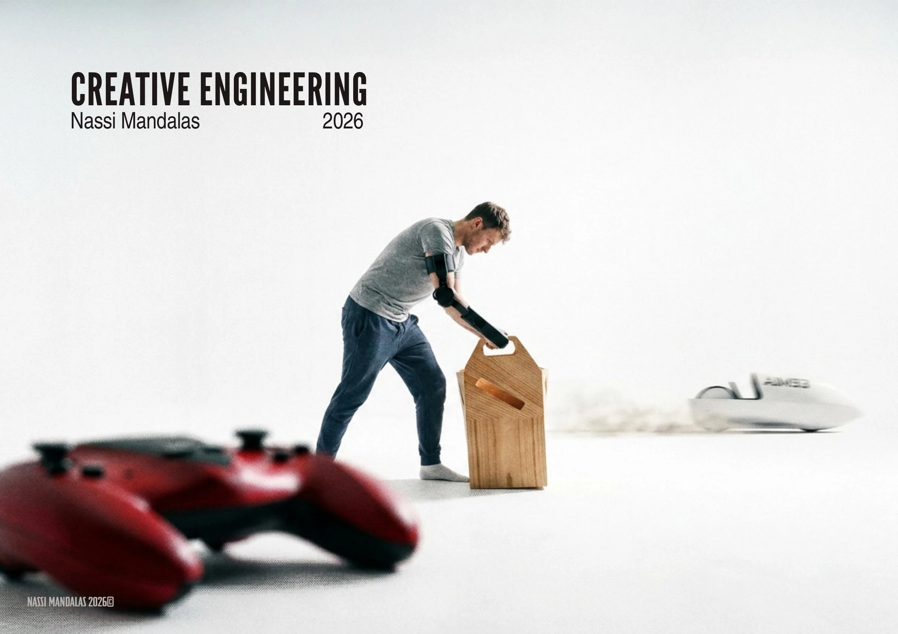
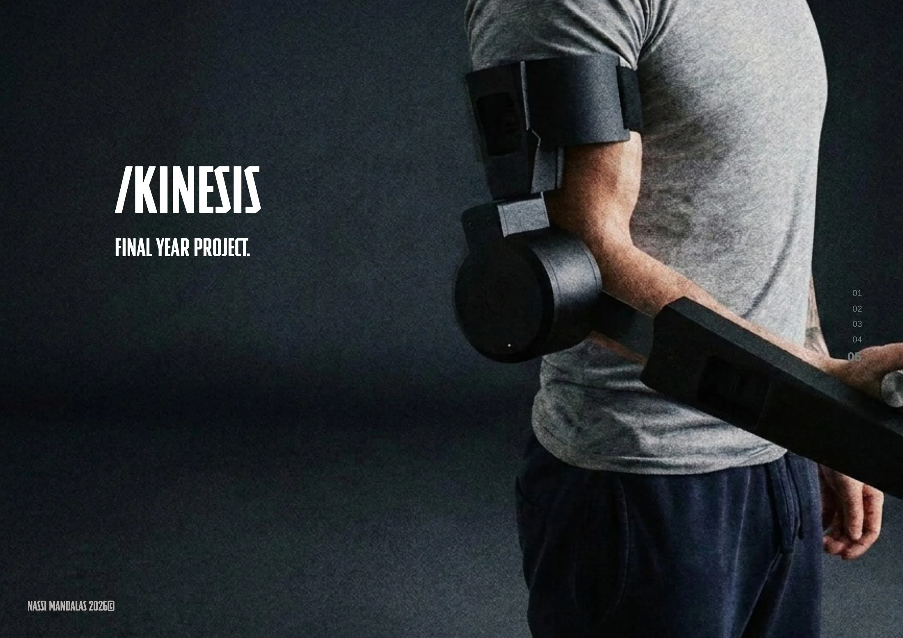
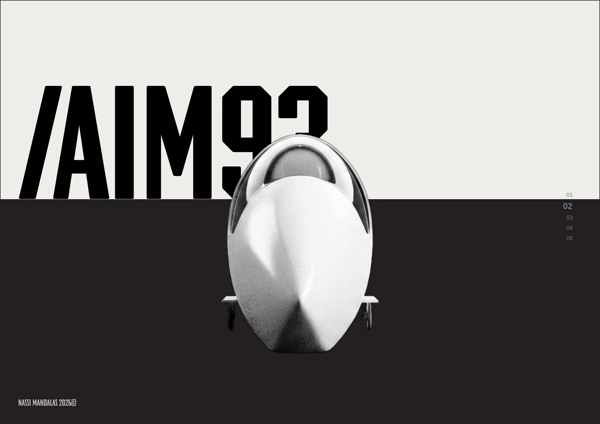
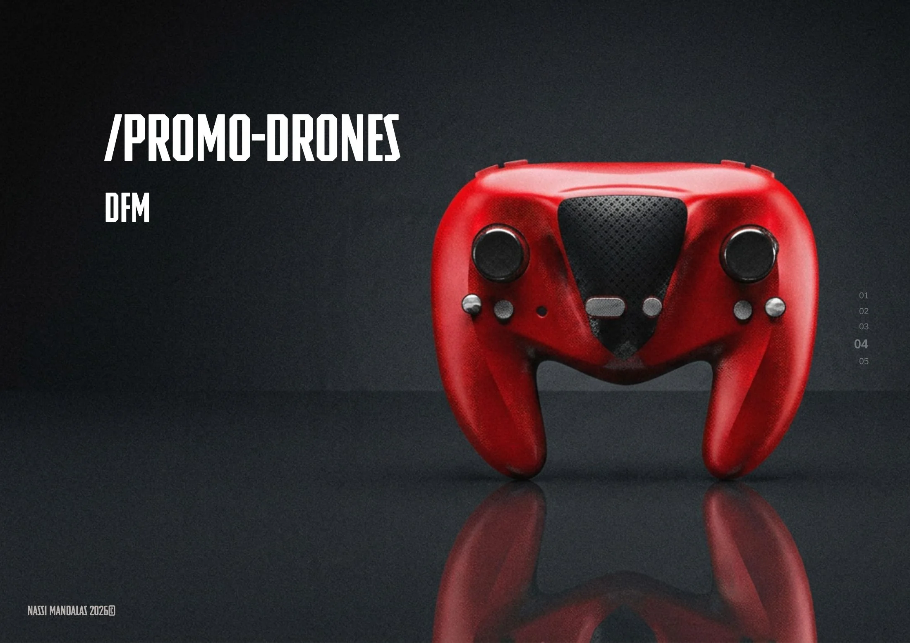
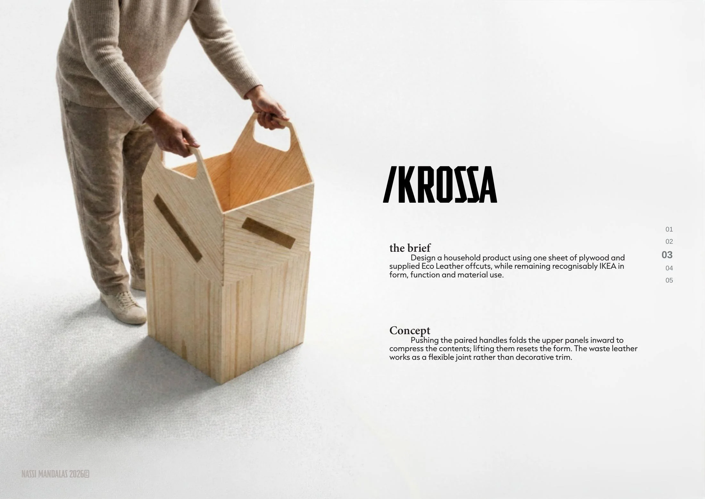

  

<h1 align="center">Nassi Mandalas</h1>

  <strong>Creative Engineer · Product Design · CAD · Physical Prototyping</strong>

  I turn ambitious ideas into physical products that can be held, tested and improved.

  <a href="#selected-work">Selected work</a> ·
  <a href="website/public/NassiMandalas-Portfolio.pdf">Full portfolio PDF</a> ·
  <a href="mailto:nassimandalas@icloud.com">Email</a>

---

## Selected work

### 01 / KINESIS

**Wearable resistance system · Research · Mechanical development · Prototyping**

A final-year project exploring adjustable physical resistance without restricting natural movement. Research, body-scale rigs and integrated prototypes led to a working system built around a BLDC motor, planetary gearbox and SimpleFOC control.

[Explore the Kinesis case study →](projects/kinesis.md)

---

### 02 / AIM93

**Aerodynamics · CAD planning · CNC tooling · Carbon-fibre lay-up**

Development of a full-scale human-powered vehicle fairing through segmented CAD geometry, CNC-machined foam tooling and composite manufacture.

[Explore the AIM93 case study →](projects/aim93.md)

---

### 03 / PROMO-DRONES

**Controller concept · Enclosure CAD · Design for manufacture**

A handheld drone-controller concept translating Honda CBR visual cues into a compact product, supported by enclosure detailing and a mould-tool study.

[Explore the Promo-Drones case study →](projects/promo-drones.md)

---

### 04 / KRÖSSA

**Household product · Circular materials · Flat-pack thinking**

A compact recycling concept made from one sheet of plywood and Eco Leather offcuts, using paired handles and flexible joints to compress its contents.

[Explore the KRÖSSA case study →](projects/krossa.md)

---

## About

I am a creative engineer with practical experience in mechanical design, prototyping and CAD. My work combines hands-on making with a clear product story, from early research and form studies through to testable physical prototypes.

**Core capabilities**

Product design · CAD development · Physical prototyping · Design for manufacture

---

## Contact

Have a physical idea worth making?

**[nassimandalas@icloud.com](mailto:nassimandalas@icloud.com)**

[Download the complete portfolio PDF](website/public/NassiMandalas-Portfolio.pdf)
