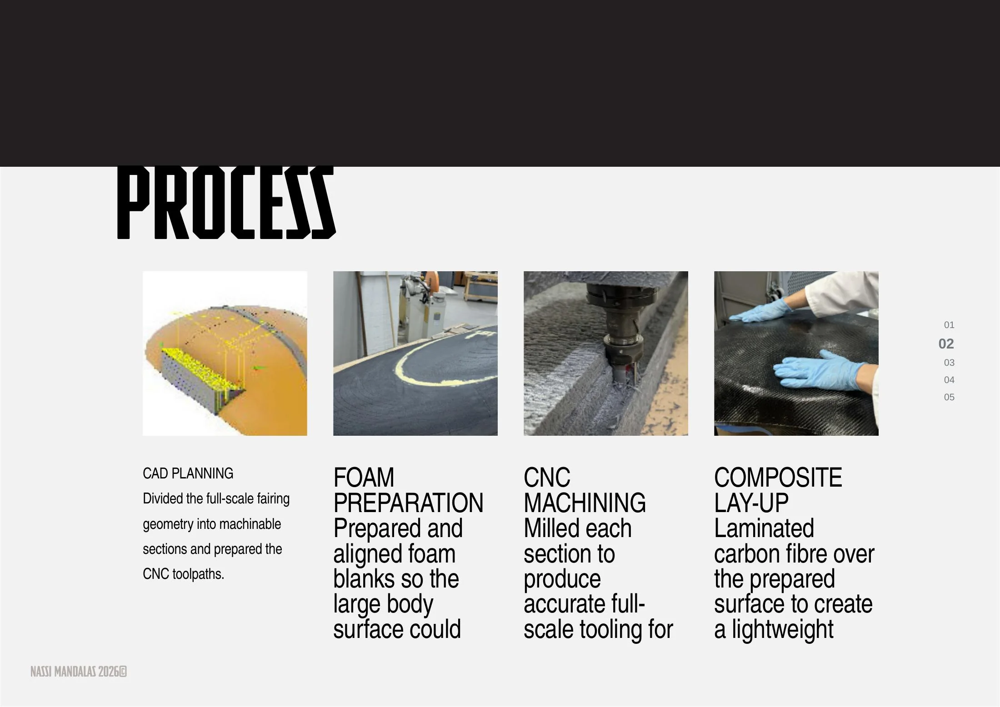
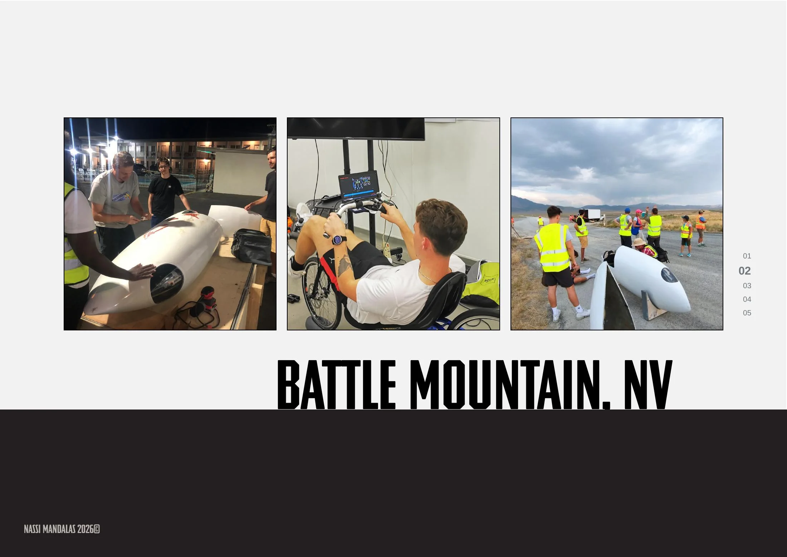

# /AIM93

**Human-powered vehicle fairing · CAD · CNC tooling · Composites**

[← Back to portfolio](../README.md) · [Download full PDF](../website/public/NassiMandalas-Portfolio.pdf)

## From digital geometry to full-scale tooling

AIM93 required a large aerodynamic fairing to be translated into a practical manufacturing process. The full-scale geometry was divided into machinable sections, creating aligned foam blanks and accurate CNC toolpaths.

The process moved through four connected stages:

1. **CAD planning** — dividing the full-scale geometry into machinable sections.
2. **Foam preparation** — preparing and aligning the large blanks.
3. **CNC machining** — milling each section to create accurate tooling.
4. **Composite lay-up** — laminating carbon fibre over the prepared surface.

## Battle Mountain, Nevada

The completed fairing and vehicle work supported the AIM93 team at Battle Mountain, Nevada, connecting the design and manufacturing process with a real competition environment.

---

**Focus:** CAD segmentation · CNC foam tooling · Composite preparation · Team development

[← Back to portfolio](../README.md)
