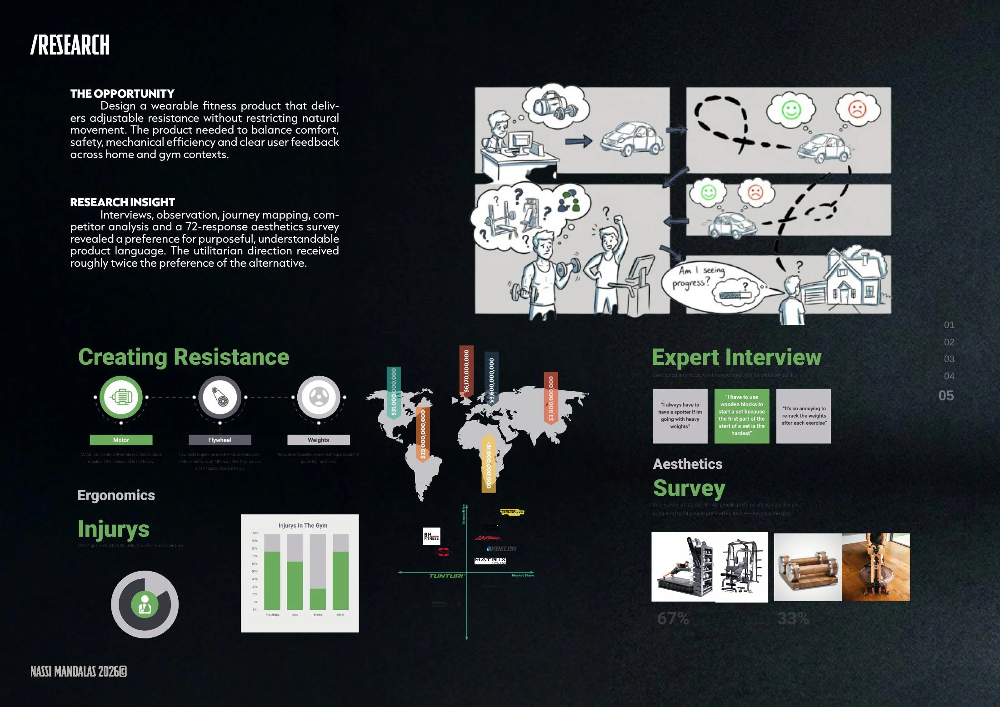
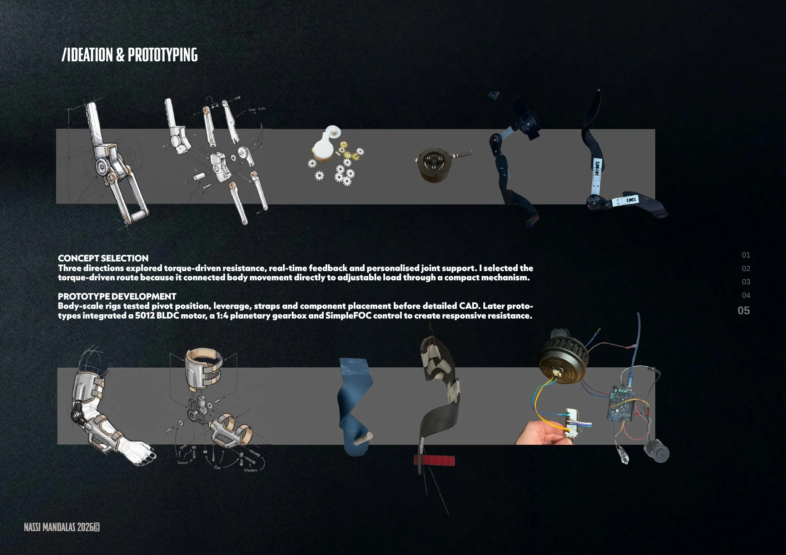
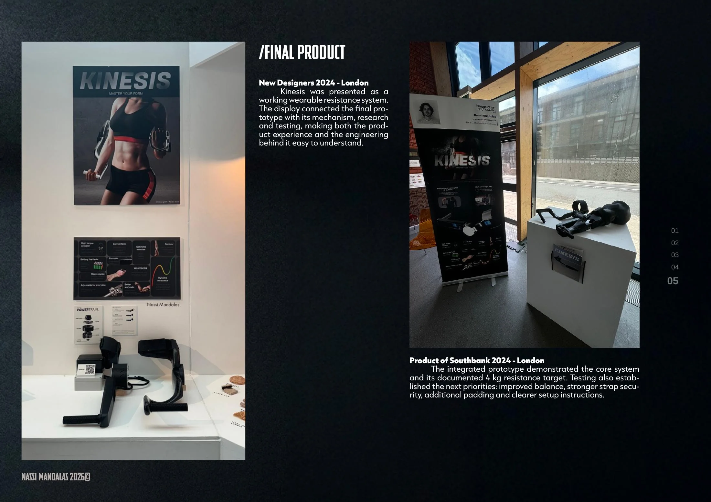

# /KINESIS

**Wearable adjustable-resistance system · Final-year project**

[← Back to portfolio](../README.md) · [Download full PDF](../website/public/NassiMandalas-Portfolio.pdf)

## The opportunity

Kinesis explores how a wearable fitness product can deliver adjustable resistance without restricting natural movement. The project balanced comfort, safety, mechanical efficiency and clear user feedback across home and gym contexts.

## Research and direction

Interviews, observation, journey mapping and competitor analysis framed the product opportunity. A 72-response aesthetics survey showed a strong preference for purposeful, understandable product language and helped establish the utilitarian direction.

## Ideation and prototyping

Three directions explored torque-driven resistance, real-time feedback and personalised joint support. Body-scale rigs then tested pivot position, leverage, straps and component placement before detailed CAD.

Later prototypes integrated a 5012 BLDC motor, a 1:4 planetary gearbox and SimpleFOC control to create responsive resistance.

## Final prototype

The integrated prototype demonstrated the core system and its documented **4 kg resistance target**. It was presented at New Designers 2024 and Product of Southbank 2024 in London.

Testing established the next priorities: improved balance, stronger strap security, additional padding and clearer setup instructions.

---

**Focus:** Product research · Mechanism development · CAD · Electronics integration · Physical prototyping

[← Back to portfolio](../README.md)
