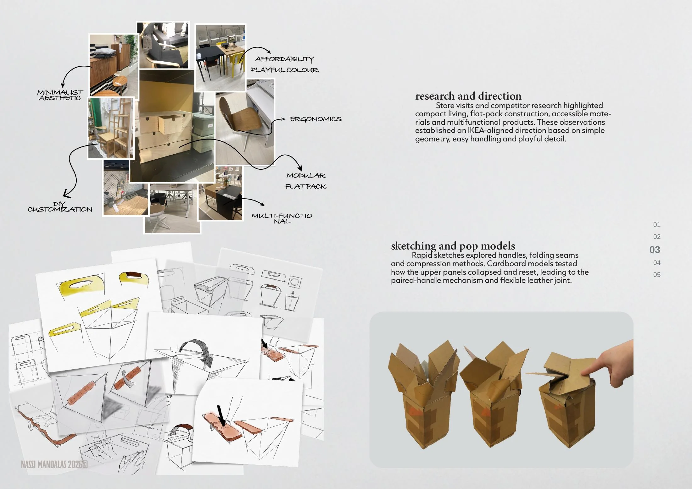
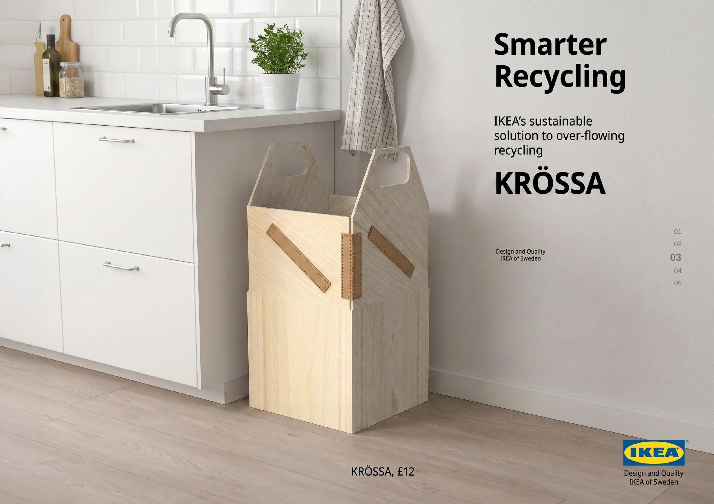

# /KRÖSSA

**Household recycling concept · Plywood · Eco Leather · Flat-pack thinking**

[← Back to portfolio](../README.md) · [Download full PDF](../website/public/NassiMandalas-Portfolio.pdf)

## The brief

Design a recognisably IKEA household product using one sheet of plywood and supplied Eco Leather offcuts.

KRÖSSA uses paired handles to fold its upper panels inward and compress the contents. Lifting the handles resets the form, while the waste leather works as a flexible joint rather than decorative trim.

## Research and development

Store visits and competitor research highlighted compact living, flat-pack construction, accessible materials and multifunctional products. Rapid sketches and cardboard models then tested handle positions, folding seams and compression methods.

## Final concept

The final concept combines simple geometry, easy handling and a playful detail while keeping the material strategy visible.

---

**Focus:** Product research · Sketching · Pop models · Circular materials · Concept visualisation

[← Back to portfolio](../README.md)
