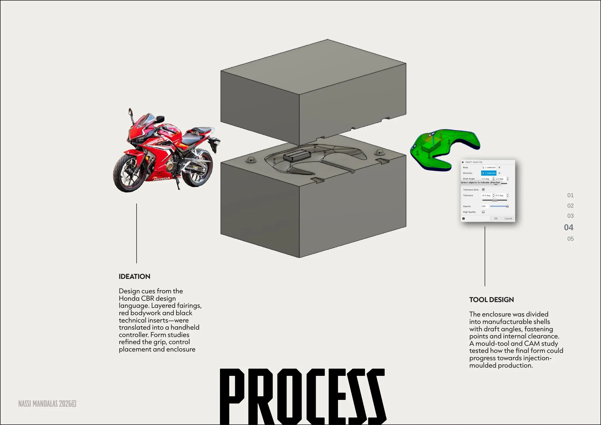

# /PROMO-DRONES

**Handheld controller concept · Enclosure CAD · DFM study**

[← Back to portfolio](../README.md) · [Download full PDF](../website/public/NassiMandalas-Portfolio.pdf)

## Translating a visual language

The concept draws on the Honda CBR design language: layered fairings, red bodywork and black technical inserts. Those cues were translated into a handheld controller while form studies refined the grip, control placement and enclosure.

## Design for manufacture

The enclosure was divided into manufacturable shells with draft angles, fastening points and internal clearance. A mould-tool and CAM study explored how the form could progress toward injection-moulded production.

The work is presented as a design and manufacturing direction rather than a production-ready product.

---

**Focus:** Form ideation · Ergonomics · Enclosure CAD · Tooling study

[← Back to portfolio](../README.md)
